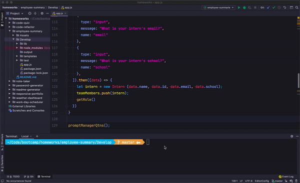

#  Employee Summary
The application will prompt the user for information about the team manager and then information about the team members. The user can input any number of team members, and they may be a mix of engineers and interns.

  ## Description
  This project's a command-line application that dynamically generates a employee summary from a user's input.

  ## Usages
  Because this is a command-line application that won’t be deployed,there is a link to a walkthrough video demonstrates the functionality of the application.

  ## Contents
  The generated README includes the following sections:

  * [Description](#description)
  * [Usage](#usages)
  * [Table of Contents](#contents)
  * [Installation](#to-run)
  * [Tests](#test)
  * [Demo](#links)
  * [Contributing](#contributing)
  * [Questions](#questions)
  * [Author](#author)

  ## To run
  - You can invoked with the following command:
  ```
  node inde.js
  ```

  ## Test
  ```
  npm run test
  ```

  ## Links
  - The following link demonstrates the deploying app: [link](https://github.com/JessMoran/employee-summary)

  - The following image demonstrates the application functionality: 
  

  ## Contributing
  
  Pull requests and stars are always welcome.
  For bugs and feature requests, please create an issue [here](https://github.com/JessMoran/employee-summary/issues)

  ## Questions
  If you're having any problem or questions, please send me a [mail](mailto:jessmoran.dev@gmail.com) and I'll be happy to help.

  ## Author
  JessMoran
  - [github](https://github.com/JessMoran)

© 2019 Trilogy Education Services, a 2U, Inc. brand. All Rights Reserved.
